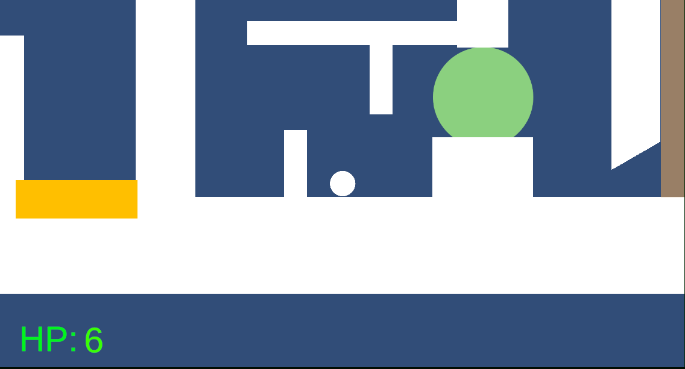

ゲーム制作技術総合実習 個人ワーク
（Circle, Triangle, Squareを使用した2Dゲーム）

# ボーロール

ゲームの内容
プレイヤーは球を移動させゴールを目指すアクションゲーム。
バウンドしたり、回転して転がり滑ったりと様々な方法でゴールを目指す。ゴールまでの道には障害物があり避けて進む。
このゲームでは重力が変わることがある。重力変化による操作変化があり変化を対応していくゲーム。
また、重力だけでなくカメラの回転も変わるので、酔いの面白さがある。
プレイヤーには体力がありステージの床や天井、壁といったあらゆるオブジェクトに触れるごとに体力が減り、0以下になるとゲームオーバー。

## 操作説明
- AとDキーで左右にボールを動かす。
- スペースキーを押すと重力と反対向きにジャンプ
